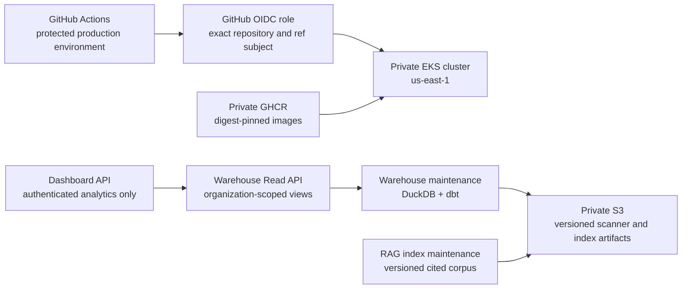

# Production Target Architecture

## Decision

Basalt’s first production release targets a **single organization in AWS `us-east-1`**. The system uses a private Amazon EKS cluster, encrypted S3-backed artifacts and Terraform state, private GitHub Container Registry images, and a private Python package registry. A domain is intentionally not hard-coded: ingress is configured through a required value supplied only by the protected production environment.

The platform is not multi-tenant in its first release. It must nonetheless carry an immutable `organization_id` through the Dashboard access decision and Warehouse read request so a later tenant boundary can be introduced without a data-model rewrite. In production, the only permitted organization is the configured deployment organization.

## Production topology

The browser never receives scanner credentials, S3 credentials, a DuckDB path, or raw scanner artifacts. Dashboard calls an authenticated read API that exposes minimized organization-scoped analytical records. Warehouse and RAG maintenance consume validated artifacts only. Basalt Agent is not a workload in EKS: it remains a local, reviewed source-remediation tool.

## Trust boundaries

| Boundary | Required control |
|---|---|
| GitHub → AWS | GitHub OIDC with immutable workflow action pins, a repository/ref-restricted trust policy, protected environment approval, and no long-lived AWS keys. |
| Kubernetes workload → AWS | EKS OIDC with a distinct IRSA role per service account. No workload uses a node role or shared static credential. |
| Dashboard → Warehouse | Authenticated service credential, `organization_id` enforcement on every query, server-side pagination limits, and no direct database or object-store access. |
| Artifact writer → S3 | Separate writer and reader policies, KMS encryption, versioning, TLS-only bucket policy, and immutable source digest metadata. |
| Browser → Dashboard | Manus OAuth session or the selected production identity provider, HTTP-only secure cookies, and no public analytics procedure. |
| Release source → runtime | Signed, scanned, SBOM-attested image digest. Helm values reference a digest, never a mutable tag. |

## Environment model

| Environment | Purpose | Permitted mutation |
|---|---|---|
| Local | Deterministic fixtures, unit/integration tests, isolated Docker builds. | Developer-owned, no cloud access required. |
| Staging | Full workflow rehearsal with a separate state key, namespace, service roles, and non-production artifacts. | Protected deployment workflow after review. |
| Production | Customer-facing single-organization service. | Protected environment approval, digest-pinned release only, explicit apply confirmation. |

No staging resource may share Terraform state, a Kubernetes namespace, an IRSA role, an artifact prefix, or an encryption key with production.

## Deferred decisions

The production custom domain, DNS provider, certificate ownership, retention period, recovery point objective, recovery time objective, and multi-tenant billing model remain intentionally unconfigured. They are deployment inputs, not source defaults. A production deployment cannot proceed until the launch checklist identifies an owner and concrete value for each required input.
